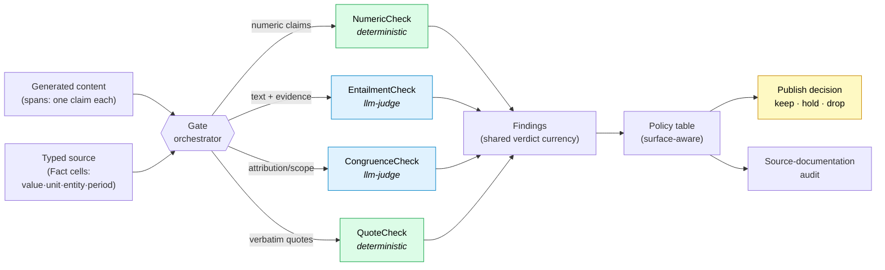
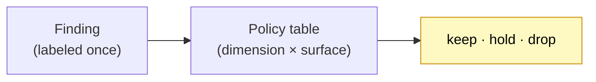
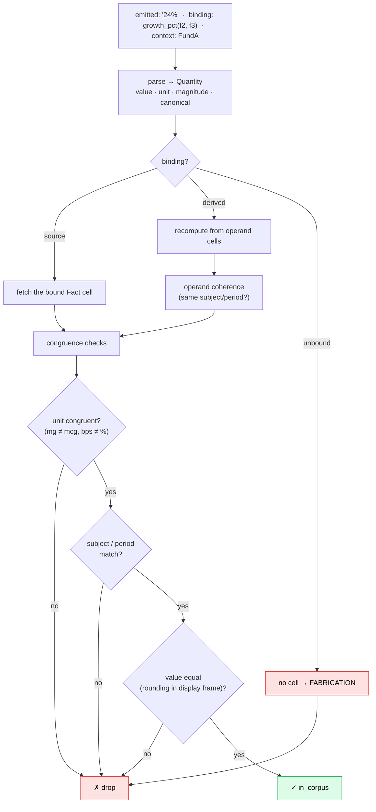
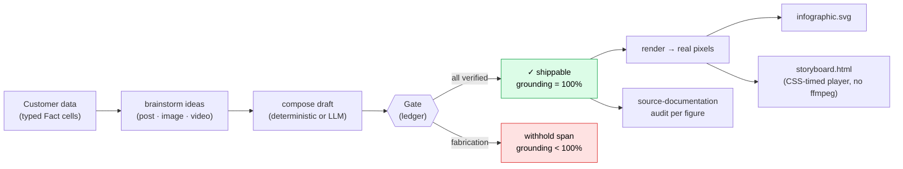
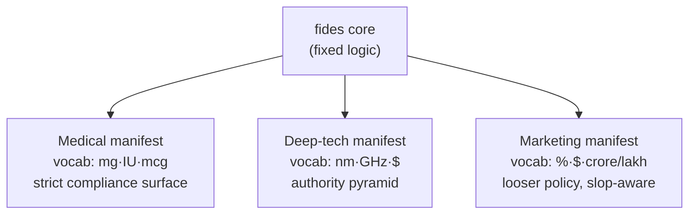

<div align="center">

# fides

**A domain-agnostic faithfulness engine — keep only what's true to the source.**

*Catch fabricated numbers, misattributed quotes, over-generalizations, and misinterpretations in AI‑generated content **before** it's published — dropping only what's fabricated, never what's genuine.*

Zero runtime dependencies · Python ≥ 3.9 · deterministic core · 118 tests · TS↔Py golden parity

</div>

---

## The problem

An LLM writes a paragraph, a marketing post, an infographic. It reads fluently. Buried in it: a number that appears in **no** source, a real number pinned to the **wrong** company, a `100 mg` dose rendered as `100 mcg`, a quote put in the wrong mouth, a hedge inflated into a superlative. A human reviewer misses it because it *looks* right.

`fides` is the gate that sits between "generated" and "published." It doesn't grade style and it doesn't guess — it **verifies each claim against the typed source** and makes a publish decision you can defend, with an audit trail for every figure.

> **The one immovable rule.** A *proven* fabrication (a deterministic `false`) is **always dropped** — no config dial can override it. The dials only govern how strict we are about *true‑but‑uncited* general knowledge. Style is never a faithfulness axis.

---

## What it does, in one call

```python
from fides import Gate, NumericCheck, EntailmentCheck, format_gate_report

gate = Gate(checks=[NumericCheck(), EntailmentCheck(judge=my_judge)])
print(format_gate_report(gate.run(spans)))
```

```text
Gate verdict — 2/4 spans published, 2 withheld  {'keep': 2, 'drop': 1, 'hold': 1}
  ✓ [keep] s1
  ✓ [keep] s2
  ✗ [drop] s3  (numeric: unbound)          ← a number in no source cell: fabrication, DROPPED
  ✗ [hold] s4  (entailment: unsupported superlative/claim)   ← "best fund ever": HELD for review
```

Two genuine claims ship; the fabricated number is dropped; the unsupported superlative is held. Run it yourself: `python3 examples/quickstart.py` (no API key).

---

## How it works — the pipeline

Content comes in as **spans** (one claim each). Every span is routed to the **Checks** that can judge it; each Check emits **Findings** in one shared vocabulary; a **policy table** turns findings into a single publish decision per span. Nothing is bespoke per span — the decision logic is uniform.



**Green = deterministic** (a proof; can drop). **Blue = llm-judge** (an opinion; never auto-drops — it holds or flags). That distinction is the backbone of the whole system.

### The two kinds of verdict

| | Deterministic | LLM‑judge |
|---|---|---|
| Example | numeric ledger, quote gate | entailment, congruence, slop |
| A `false` means | a **proof** of fabrication | an **opinion** it's unsupported |
| On `false` | **always drops** (immovable) | **never auto-drops** — holds/flags |
| Fails safe by | typed mismatch → drop | abstaining (unavailable judge ≠ guilty) |

---

## The verdict currency: `Finding`

Every Check, however different inside, speaks one language. That's what lets one policy table decide everything.

| field | values | role |
|---|---|---|
| `dimension` | numeric · entailment · congruence · quote · slop | which Check produced it |
| `kind` | deterministic · llm_judge | proof vs opinion (governs whether it can drop) |
| `groundedness` | in_corpus · true_uncited · false · abstain | **surface‑invariant** label |
| `severity` / `confidence` | low·med·high / float | how strong |
| `source_locators` | [(snapshot, block, row, col), …] | the audit trail |



`groundedness` is **surface‑invariant** — a claim is labeled once (is it in the corpus? true but uncited? false? unknowable?), and the **surface** (compliance vs marketing vs internal) decides the *consequence* as pure policy. The same fabrication drops on every surface; a true‑but‑uncited aside might hold on a compliance doc and pass on a blog. One label, many policies — no re-judging.

---

## The deterministic heart: the Numeric Ledger

This is what makes `fides` more than "does the number's text appear in the source." Instead of substring/n‑gram matching, it **types every quantity** and verifies the *meaning*.



It catches the failures a text-match misses — each is a real, adversarially‑tested case in `examples/proof.py`:

| Failure mode | Example | Verdict |
|---|---|---|
| **Fabrication** | a number in no source cell | drop |
| **Wrong‑but‑real cell** | a *peer's* return quoted as this fund's | drop |
| **Unit swap** | `100 mg` → `100 mcg` (1000× dose error); `65 bps` → `65%` | drop |
| **Period swap** | the 2024 figure labeled 2023 | drop |
| **Derived incoherence** | "growth" computed across two *different* subjects | drop |
| **Verbatim drift** | `12.4%` restated as `12.40%` under a strict surface | drop |
| **Genuine** | the right value, right cell, right period | **keep** |

Units, periods, and derivations are *computed structure* (code's job). Which company a value is *about*, whether a claim is *supported* — that's *meaning* (the LLM's job). fides never blurs the two.

---

## The other Checks

- **QuoteCheck** *(deterministic)* — a no‑fabrication span gate for verbatim quotes: exact → windowed fuzzy (`difflib ≥ 0.95`) → longest‑contiguous rebind (`≥ 70%`), with typography/whitespace normalization. Proves a quote actually exists in the source.
- **EntailmentCheck** *(llm‑judge)* — is this sentence entailed by its cited evidence? Injected judge returns `supported | violated | abstain`; fail‑safe to `abstain`.
- **CongruenceCheck** *(llm‑judge)* — attribution ("is this value about the right entity?") and over‑generalization ("does the claim over‑reach the evidence?").
- **Anti‑slop** *(separate quality track)* — AI‑cliché/filler phrases, empty sentences, hedge‑rate, low info density → a `slop_score`. **Slop is a usefulness axis, never a truth axis** — it's advisory and *subordinate* to faithfulness; a sloppy sentence is not a lie and is never dropped as a fabrication.

All judges are **injected**, never hardcoded — swap in `fides.adapters.openai_judge` for production, a deterministic stub for tests. An unavailable judge **abstains**; it never guesses guilt.

---

## From verifier to product: the Grounded Content Studio

The verifier flips around into a **generator**. `ContentStudio` brainstorms marketing assets from a customer's typed data — and because every number is gated by the ledger, deterministic assets are **grounded by construction** (an infographic literally cannot display a figure that isn't in the data), while an LLM‑drafted post has its fabrications dropped before it ships.



`fides.render` turns the verified spec into **real, openable files with zero deps** — SVG posters and a self‑contained HTML video player — and *refuses to render an un‑shippable asset*, so grounding survives all the way to the canvas. Heavy rasterization (PNG/mp4) stays an injectable consumer adapter.

### Try the studio in your browser (no API key, stdlib only)

```bash
python3 examples/serve.py     # → open http://localhost:8000
```

Pick one of six preset datasets (finance · clinical · energy · SaaS · sports · elections) or enter your own; fides brainstorms a grounded post + infographic + video, renders them inline with a grounding score and per‑figure audit — then tick **"inject a fabricated stat"** and watch the gate drop it in real time.

---

## Tuning per use case: the Manifest

The engine is fixed; the *tuning surface* is a small `GateManifest`. One core, many verticals:



The manifest carries: unit vocabulary, the policy table, confidence floor, which surfaces are strict/verbatim/period‑required, and which dimensions are enabled. A legal or financial vertical reuses the core untouched — it only ships a new manifest.

---

## Precision/recall harness — proving "keep genuine, drop fabricated"

fides is measured, not asserted. `harness.py` scores a labeled gold set on a **`dimension × surface‑tier`** matrix with **Wilson confidence intervals**. The ship‑gate is explicit:

- **fabrication‑escape rate → must be 0** (nothing false gets through), and
- **genuine‑recall → maximized** (we don't throw away true content).

`examples/proof.py` runs this end‑to‑end across 6 domains: all grounded assets ship at 100%, and a 13‑case adversarial battery drops **7/7 fabrications with 0 escapes and no genuine loss**.

---

## Cross‑language conformance

The numeric calculus has a TypeScript twin (its origin in `novelfusion`). `goldens/numeric_golden.json` is a **language‑neutral vector corpus** (34 cases) that both implementations must satisfy byte‑for‑byte, so the Python core and the TS twin can never silently diverge.

---

## Install & layout

Zero dependencies — copy the package in, or:

```bash
pip install -e .        # editable, from the repo root
python3 -m pytest -q    # 118 tests
```

```text
fides/
  finding.py     verdict currency + surface policy table (the one immovable rule)
  gate.py        orchestrator: spans → checks → findings → one decision + audit
  manifest.py    per-use-case tuning surface (unit vocab, policy, strict surfaces)
  numeric/       the deterministic ledger — parse · canonicalize · recompute · congruence · audit
  semantic/      entailment · congruence · robust judge wrappers (cache/retry/chunk/multi-lens)
  text/          QuoteCheck + fuzzy span verification (absorbed from factra)
  slop.py        anti-slop quality track (separate from truth)
  quality.py     tripwires: value-leak audit, goodhart, hedge lexicon
  studio.py      grounded content studio (brainstorm → ground → rank)
  render.py      verified spec → SVG / HTML pixels (zero-dep)
  generate.py    GroundedGenerator: plan → draft → verify → repair
  harness.py     precision/recall harness (Wilson CIs)
  adapters/      injectable OpenAI judges
goldens/         cross-language conformance vectors (TS↔Py parity)
examples/        quickstart · studio · serve (UI) · proof · multi_lens · end_to_end
```

---

## Examples

| File | What it shows |
|---|---|
| `examples/quickstart.py` | verify a mini answer with one `Gate` call (no key) |
| `examples/serve.py` | the browser studio UI (stdlib `http.server`, 6 preset domains) |
| `examples/studio.py` | brainstorm + ground + render posts/infographics/videos to real files |
| `examples/proof.py` | 6-domain grounded production + 13-case adversarial gate (escapes = 0) |
| `examples/multi_lens.py` | perspective-diverse judging + the harness A/B that gates it |
| `examples/end_to_end.py` | all subsystems exercised on one scenario |

---

## Design principles (why it's built this way)

1. **Code owns structure; the model owns meaning.** Units, periods, derivations, IDs → code. Attribution, relevance, interpretation → LLM. Neither is allowed to do the other's job.
2. **Deterministic proofs drop; opinions hold.** Only a proof can silently remove content; a judge's `false` escalates to review.
3. **Generation is a layer, never the core.** The verifier is the invariant; drafters, ideators, renderers are injected.
4. **Label once, apply as policy.** Surface‑invariant groundedness + a policy table — no per‑surface re‑judging.
5. **Fail safe.** An unavailable judge abstains; an uncheckable span holds. Never fail open.
6. **Measured, not asserted.** Every claim of correctness is backed by the harness or a golden vector.
```
python3 -m pytest -q
```
