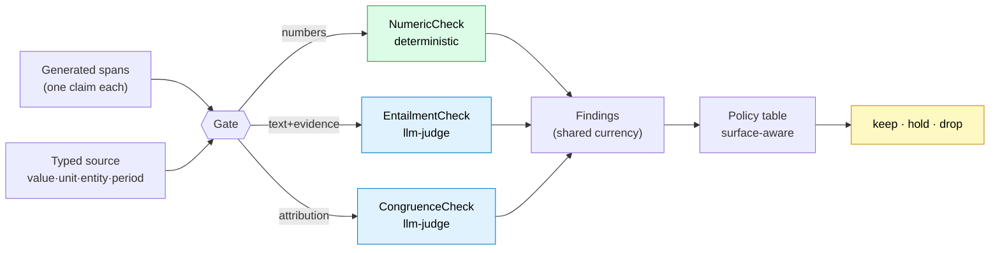

# Fides: Treating "AI faithfulness" as a research problem, not a prompt

*Repo: https://github.com/4sgupta828/fides · 118 tests · 0 fabrication-escapes on the adversarial suite · TS↔Python golden-vector parity*

---

## The industry problem

The GenAI demo is beautiful; the pilot ships; then a generated report says a fund returned **12.4%** when the source says the *benchmark* did — or renders a **100 mg** dose as **100 mcg** — and it reads perfectly. A human reviewer misses it because it *looks* right.

This is the real blocker to AI in finance, healthcare, legal, and compliance. Not "is the model smart enough?" but a governance question:

> **Can I prove this specific sentence is true to the source before it's published?**

Fluency is solved. **Faithfulness is not.** And the industry's default answer — "ask another LLM if it's hallucinated" — is asking the fox to audit the henhouse.

## Framed as a research problem

| | |
|---|---|
| **Input** | Generated content (spans) + typed source (fact cells) |
| **Output** | A per-claim decision: `keep · hold · drop`, with an audit trail |
| **Objective** | Maximize *genuine recall* subject to a hard constraint: **fabrication-escape rate = 0** |
| **Key tension** | It's trivial to drop everything (0 escapes, 0 recall). The science is *keeping the true and dropping only the false* — measured on held-out, adversarial data |
| **Core hypothesis** | Faithfulness is not one problem. Split it: **code owns structure, the model owns meaning** — and never let either do the other's job |

## The architecture



**Green = deterministic proof** (can drop content). **Blue = llm-judge opinion** (can only hold for review). That distinction is the whole backbone, and it's one immovable rule in code:

```python
# a PROVEN fabrication is always dropped; no config dial overrides it
def surface_policy(f, policy):
    if f.kind == "deterministic" and f.groundedness == "false":
        return "drop"
    ...
```

The deterministic heart is a **numeric ledger** — it types every quantity and verifies *meaning*, not substring presence:

```python
verify_claim({"emitted": "65%",
              "binding": {"kind": "source", "factId": "expense_ratio"}},  # source = 65 bps
             facts, opts={"strict": True})
# → {"ok": False, "code": "value_mismatch"}   # 65 bps ≠ 65%, caught. Substring match would PASS.
```

## What one call does

```text
Gate verdict — 2/4 spans published, 2 withheld
  ✓ [keep] s1
  ✓ [keep] s2  (derived: 26% YoY, recomputed from two source cells)
  ✗ [drop] s3  (numeric: unbound)          ← a number in no source cell
  ✗ [hold] s4  (entailment: unsupported superlative)   ← "best fund ever"
```

## What AI solves — and what it must never be asked to do

| Task | Owner | Why |
|---|---|---|
| Is this claim entailed by the evidence? | **LLM (as judge)** | Meaning; models are good at this — as critics, not authors |
| Is the quote attributed to the right entity? | **LLM (as judge)** | Semantic judgment |
| Does `65 bps == 0.65%`? Is the period 2023 or 2024? | **Code** | Structure & computation — a model here *reintroduces* the bug |
| Recompute a derived number from operands | **Code** | Determinism |
| Final publish decision | **Policy table** | Auditable, not a vibe |

## What stays genuinely hard (the open problems)

1. **The wrong-but-real cell.** A number that exists in the source but answers a *different* question. Provenance ("this string exists") is necessary but never sufficient for correctness. Fides's own adversarial suite makes this its hardest class.
2. **Honest recall measurement.** Anyone can report "zero fabrications." The falsifiable metric is a `dimension × surface-tier` precision/recall matrix with Wilson confidence intervals — escapes must be 0 *while* recall is maximized.
3. **Cross-language drift.** The moment your calculus lives in two runtimes (a TS product + a Python service), they silently diverge. Fides pins 34 language-neutral golden vectors so they can't.

## How to take it from here

- Put the P/R harness in CI as a **ship gate** (escape rate must stay 0).
- Wire real LLM judges over a clean tool boundary; keep the deterministic core language-neutral.
- Extend typed checks beyond numbers → dates, named entities, citations, units-of-measure.
- Run the verifier *backwards* as a generator: a grounded content studio where an infographic **cannot** render a figure that isn't in the data.

## Use cases → products

| Use case | Product shape |
|---|---|
| Any GenAI → publish surface | A "publish gate" API between the model and the world |
| Pharma/finance marketing | Grounded content studio where compliance is *structural* |
| RAG pipelines | A verification layer that catches wrong-cell errors retrieval can't |
| Regulated reporting | An audit-trail generator ("source documentation for every figure") |

## To understand this space better

`FActScore` · `RAGAS` · `SelfCheckGPT` · `TruthfulQA` · Google's **Attributable to Identified Sources (AIS)** · the NLI/entailment literature. The throughline every one of them keeps rediscovering: **attribution ≠ correctness.**

---

*The uncomfortable takeaway: the last mile of enterprise AI isn't a better model — it's a verifier the model isn't allowed to overrule.*

**#AI #LLM #TrustworthyAI #RAG #Fintech #HealthcareAI #MLOps #ProductManagement**
