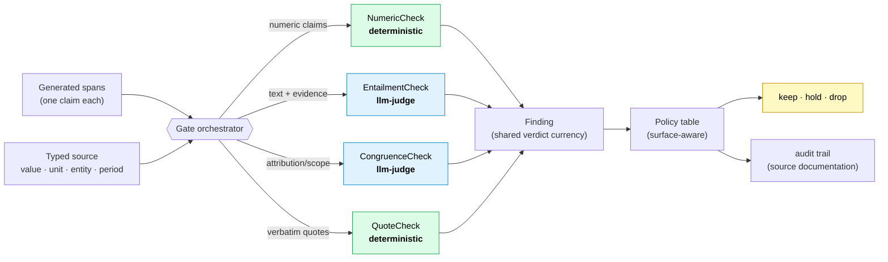

# Fides: Engineering faithfulness into AI — why the last mile of enterprise AI is a verifier the model isn't allowed to overrule

*Repo: https://github.com/4sgupta828/fides · a domain-agnostic faithfulness engine · 118 tests · 0 fabrication-escapes on the adversarial suite · TS↔Python golden-vector parity · zero runtime dependencies*

> **TL;DR for the people who sign off on AI:** The blocker to shipping GenAI in finance, healthcare, and legal isn't model quality — it's that no one can *prove* a generated sentence is true to its source before it's published. Fides treats faithfulness as a typed, deterministic verification problem, drawing a hard line between what code must own (structure, computation) and what an LLM may own (meaning, judgment). The result is a publish gate with a falsifiable guarantee — *a proven fabrication cannot ship* — and a measurement harness that proves it, adversarially, on held-out data.

---

## 1. The problem, stated the way a CFO would state it

The demo is beautiful. The pilot ships. Then a generated quarterly summary says a fund returned **12.4%** when the source says the *benchmark* did. A patient-facing draft renders a **100 mg** dose as **100 mcg** — a 1000× error. A marketing page turns "the data suggests a favorable outcome" into "the #1 solution, guaranteed."

Every one of those reads perfectly. A human reviewer misses it because it *looks* right. And in a regulated business, a single one of these is a retraction, a fine, or a lawsuit.

This is why "AI for the enterprise" stalls after the pilot. The question that kills the deal is never "is the model smart enough?" It's a governance question the model itself cannot answer:

> **Can I prove this specific sentence is true to the source, before it's published — and show my work if a regulator asks?**

Fluency is a solved problem. **Faithfulness is not.** And the industry's reflexive answer — "ask another LLM whether the first one hallucinated" — is asking the fox to audit the henhouse. A model that confabulates a fact will, with equal confidence, confabulate a justification for it.

## 2. Why the obvious approaches fail

The two default strategies both fail in ways that matter:

| Approach | Why it looks fine | Why it fails in production |
|---|---|---|
| **Substring / n-gram matching** ("does the number appear in the source?") | Cheap, deterministic, catches invented numbers | Passes the *wrong-but-real cell*: "12.4%" appears in the source — but it's the benchmark's return, not the fund's. It also passes unit and period swaps: `65 bps` and `65%` share the digits `65`. |
| **LLM-as-judge** ("model, is this hallucinated?") | Catches semantic errors, flexible | Non-deterministic, un-auditable, and structurally unable to police its own failure modes. It will bless a plausible fabrication and abstain on a true claim. You cannot ship a compliance guarantee on a coin flip. |

The insight that makes Fides work is that "faithfulness" is *not one problem*. It's at least two, and they have opposite owners.

## 3. The thesis: code owns structure, the model owns meaning — and neither does the other's job

This is the single design decision everything else follows from.

- **Structure and computation are deterministic.** Whether `65 bps == 0.65%`, whether a value belongs to the 2023 or 2024 period, whether a derived growth rate actually recomputes from its operands — these are *calculations*, not judgments. The moment you hand them to an LLM, you have re-introduced the failure you were trying to prevent.
- **Meaning is the model's job.** Whether a sentence is *entailed* by its evidence, whether a quote is attributed to the right entity, whether a claim over-generalizes — these are genuine semantic judgments where LLMs are strong *as critics*, not as authors.

Fides draws that line in code and never lets it blur.



Every check, however different inside, emits the same object — a **Finding** — so one policy table can decide everything uniformly. A Finding carries a `kind` (deterministic proof vs. llm-judge opinion) and a **surface-invariant** `groundedness` label (`in_corpus` / `true_uncited` / `false` / `abstain`). The claim is labeled *once*; the surface (compliance vs. marketing vs. internal) decides the *consequence* as pure policy. That separation is what lets the same engine be strict on a 10-K and lenient on a blog without re-judging anything.

And there is exactly one rule no configuration can override:

```python
# fides/finding.py — the immovable invariant
def surface_policy(f, policy):
    # a PROVEN fabrication (deterministic false) is ALWAYS dropped — no dial reaches this
    if f.kind == "deterministic" and f.groundedness == "false":
        return "drop"
    # everything else is policy: llm-judge findings HOLD for review, never silently drop
    ...
```

**The tradeoff we chose here, explicitly:** deterministic checks are allowed to *delete* content (they carry a proof); LLM judges are only allowed to *hold* it for human review (they carry an opinion). This asymmetry is deliberate. It means a flaky judge can never silently censor a true statement — the worst it can do is escalate to a human. Only a mathematical proof of fabrication removes content without a person in the loop.

## 4. The deterministic heart: a numeric provenance ledger

The part that supersedes n-gram matching is a typed ledger. Instead of "does this number's text appear," it asks "is this number *the right value, in the right unit, about the right entity, for the right period* — or correctly *derived* from cells that are?"

```python
verify_claim(
    {"emitted": "65%",
     "binding": {"kind": "source", "factId": "expense_ratio"}},  # source cell = "65 bps"
    facts, opts={"strict": True})
# → {"ok": False, "code": "value_mismatch"}   # 65 bps = 0.65%, not 65%. A substring check would PASS this.
```

Under the hood it does the un-glamorous work that actually matters:

- **`parse_quantity`** types every number into `{value, unit, magnitude, canonical}`. A unit that isn't modeled (mg, GW) is preserved as a *named token*, never silently dropped — which is exactly what stops `100 mg` from comparing equal to `100 mcg`.
- **`units_congruent`** — `bps` vs `%`, `mg` vs `mcg`, `USD` vs `EUR` are incongruent; a fabrication hiding as a unit swap is caught.
- **`values_equal`** compares in the *display frame* (rounding by emitted decimals), so `$1.2B` and `$1.23B` match but `$1.2B` and `$1.26B` don't.
- **`recompute`** verifies derived numbers (`growth_pct`, `share_of`, `ratio`) actually recompute from their operands — *and* that the operands co-refer to the same subject, so "24% growth" computed across two different funds is rejected as `operands_incoherent`.

Content-addressed fact IDs, verbatim locators for the audit trail, and a `verbatim` mode that rejects `12.40%` as a restatement of `12.4%` on surfaces where the exact string is legally required.

## 5. The decisions and tradeoffs (the part investors actually want)

| Decision | The alternative we rejected | What we gave up | Why it's worth it |
|---|---|---|---|
| Typed numeric ledger | n-gram / substring matching | Simplicity; a few lines of code | Substring matching cannot catch the wrong-but-real cell — the most common *and* most dangerous error |
| Deterministic checks may drop; judges may only hold | Let the LLM judge drop content too | Some recall (judges could auto-remove) | A non-deterministic gate must never silently delete a true statement; humans adjudicate opinions |
| Surface-invariant groundedness + policy table | Bake the surface into each check | Convenience | One label, many surfaces, no re-judging; the compliance/marketing difference becomes config, not code |
| Injected judges (never hardcoded) | Bundle a specific model | Turnkey defaults | Model-agnostic; an unavailable judge *abstains* (fails safe) rather than guessing guilt |
| Zero runtime dependencies + TS↔Python golden parity | One canonical implementation | Duplicate effort across runtimes | A verification calculus that lives in a TS product *and* a Python service will silently diverge; 34 language-neutral golden vectors make that impossible |
| Generation is a *layer*, not the core | Build a bespoke generator | Feature velocity | The verifier is the invariant; run it backwards and an infographic is grounded *by construction* — it literally cannot render a figure that isn't in the data |

## 6. How we know it actually works — the measurement, not the vibe

This is the section that separates a demo from a product. Anyone can claim "zero hallucinations." The engineering question is: *how do you know, and could you be fooled?*

Fides ships a **precision/recall harness** that scores a labeled gold set on a `dimension × surface-tier` matrix with **Wilson confidence intervals**, against an explicit ship-gate:

- **Fabrication-escape rate must be 0** — nothing labeled false gets through. (The safety constraint.)
- **Genuine-recall is maximized** — we don't achieve safety by dropping everything. (The utility constraint.)

The second metric is the honest one. It's trivial to get zero escapes by dropping all content; the whole discipline is *keeping the true and removing only the false*, measured adversarially.

And the measurement earns its keep — it has caught real bugs in Fides itself:

- A **judge panel** found that `values_equal` was rounding in the wrong frame, collapsing sub-50bps differences to zero. Fixed by computing rounding in the display frame.
- The adversarial multi-domain proof (`examples/proof.py`, 6 domains + a 13-case battery) surfaced a **genuine safety defect**: a labeled unit like `mg`/`mcg` was being dropped by the parser and the number treated as a bare count — so `100 mg` verified *equal* to `100 mcg`. That is the exact 1000× dose error that could hurt someone, and the eval caught it before any human would have. Fixed by preserving unit tokens; a regression test now guards it forever.

That's the loop that matters: **an adversarial eval that finds your own bugs before production does.** The golden-vector conformance (34 cases, byte-identical across TypeScript and Python) is the falsifiable platform test — the two runtimes cannot drift without a red build.

## 7. What stays genuinely hard (the honest section)

1. **The wrong-but-real cell.** Provenance ("this string exists at this locator") is *necessary but never sufficient* for correctness. A locator can point at a real-but-wrong cell. Closing this needs gold-value checks on held-out data, not more provenance.
2. **Recall under adversarial paraphrase.** Semantic checks are only as good as the judge and the evidence it's shown. Compression anywhere in the pipeline — truncated windows, top-N retrieval, simplified schemas — can delete the very discriminator the judge needs.
3. **Inference provenance.** Verifying that each *sentence* is grounded is not the same as verifying that the *conclusion follows* from the grounded sentences. Grounded derivation is the frontier.

## 8. How to take it from here

- Put the P/R harness in CI as a **hard ship gate** — escape rate 0 or the build is red.
- Wire real LLM judges over a clean tool boundary (OpenAI/Anthropic adapters exist); keep the deterministic core language-neutral.
- Extend typed checks beyond numbers → dates, named entities, citations, units-of-measure.
- Add a second gate on *inference provenance* (does the conclusion follow from the cited claims?).

## 9. Use cases → the product surface

| Use case | Product |
|---|---|
| Any GenAI → a publish surface | A "publish gate" API between the model and the world |
| Pharma / finance marketing | A grounded content studio where compliance is *structural*, with an auto-generated source-documentation audit per figure |
| RAG pipelines | A verification layer that catches the wrong-cell errors retrieval quality cannot |
| Regulated reporting | An audit-trail generator that survives a regulator's "show me the source for this number" |

## 10. To understand the space

`FActScore` · `RAGAS` · `SelfCheckGPT` · `TruthfulQA` · Google's **Attributable to Identified Sources (AIS)** · the NLI / entailment literature. The throughline every one keeps rediscovering: **attribution ≠ correctness.** Provenance tells you a system didn't fabricate a span; it does not tell you the system picked the right one.

---

*The last mile of enterprise AI isn't a smarter model. It's a verifier the model isn't allowed to overrule — with a measurement harness honest enough to find its own bugs.*

**#AI #LLM #TrustworthyAI #RAG #Fintech #HealthcareAI #MLOps #ProductManagement #AIGovernance**
